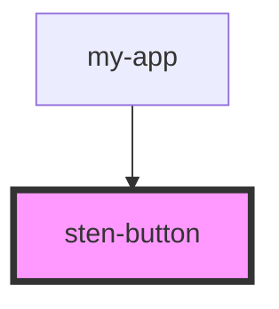

# sten-button

<!-- Auto Generated Below -->

## Properties

| Property | Attribute | Description | Type                                                    | Default     |
| -------- | --------- | ----------- | ------------------------------------------------------- | ----------- |
| `msg`    | --        |             | `{ name: string; age: number; sex: "man" \| "woman"; }` | `undefined` |
| `name`   | `name`    |             | `string`                                                | `'2123'`    |

## Dependencies

### Used by

 - [my-app](../my-app)

### Graph

----------------------------------------------

*Built with [StencilJS](https://stenciljs.com/)*
